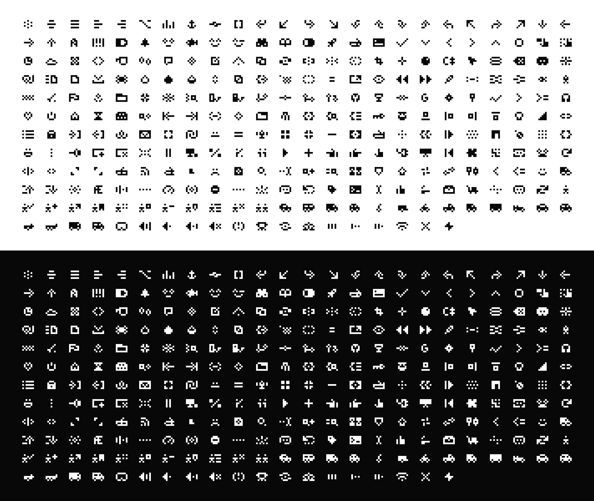

# @indxsearch/pixl

Pixel icons for React by [Indx](https://indx.co). Every icon sits on a strict 7×5 grid and is drawn with the grayscale levels and accent colors of [`@indxsearch/systm`](https://www.npmjs.com/package/@indxsearch/systm), so icons follow light and dark mode automatically.



## Installation

```bash
npm i @indxsearch/pixl
```

React 18 or 19 is required as a peer dependency.

## Usage

```tsx
import { Search, Folder, Vehicle_van } from '@indxsearch/pixl';

export function Example() {
  return (
    <>
      <Search />
      <Folder size={28} />
      <Vehicle_van size={42} color="var(--lv5)" />
    </>
  );
}
```

Component names come from the icon names. The first letter is capitalized and spaces become underscores, so `vehicle van` is `Vehicle_van` and `chevron down` is `Chevron_down`.

### Props

| Prop | Type | Default | Description |
|---|---|---|---|
| `size` | `number \| string` | `21` | Width. The height follows the 7:5 ratio. |
| `color` | `string` | none | Paints the whole icon in one color. Leave it out to keep the icon's own fills. |

Icons stay crisp at multiples of 7: `14`, `21`, `28`, `35` or `42`.

### Colors and dark mode

Icon fills are CSS variables:

- **Levels** `--lv0`…`--lv8` and **accents** such as `--CSignal` come from `@indxsearch/systm`. Import `@indxsearch/systm/styles.css` once in your app. The levels switch automatically in dark mode.
- **Pixl colors** `--pixl-*` are named colors defined in the pixl editor. Each carries its light value as a fallback, so icons render without extra CSS. Import the stylesheet to get their dark values:

```tsx
import '@indxsearch/systm/styles.css';
import '@indxsearch/pixl/colors.css';
```

Passing `color` overrides every fill, which is handy for single-tone use inside buttons or text. Multi-color icons only look as designed when `color` is left out.

## Pixl Editor

The icons are drawn in Pixl Editor, a small Figma-like canvas that lives in this repo in [`editor/`](editor/README.md).


See [editor/README.md](editor/README.md) for features and shortcuts, and [UPDATING.md](UPDATING.md) for how to add icons and publish a release.

## License

The icons are Indx brand assets. All rights reserved. See [LICENSE](LICENSE).
