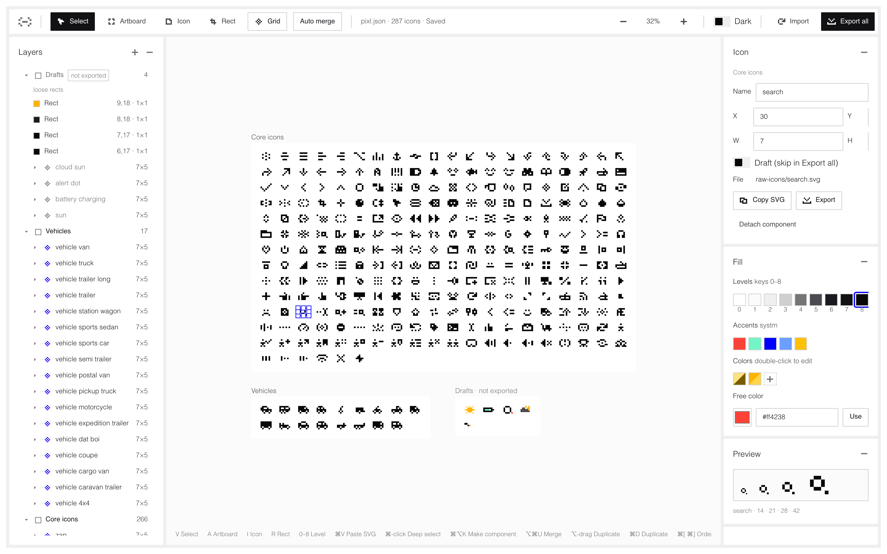
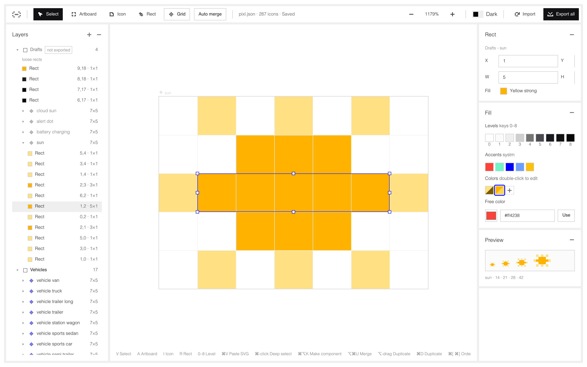
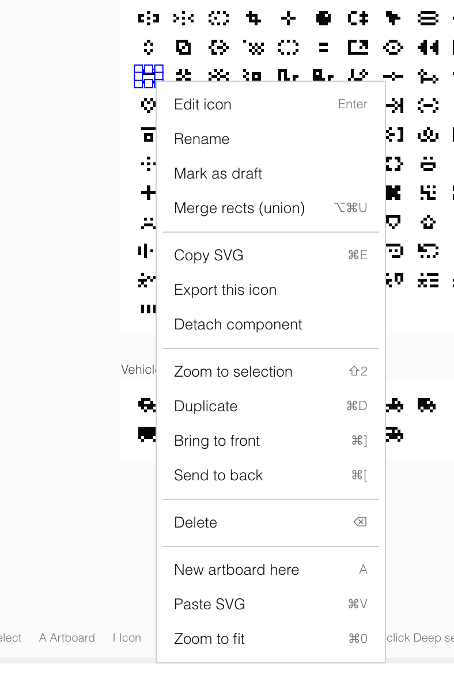
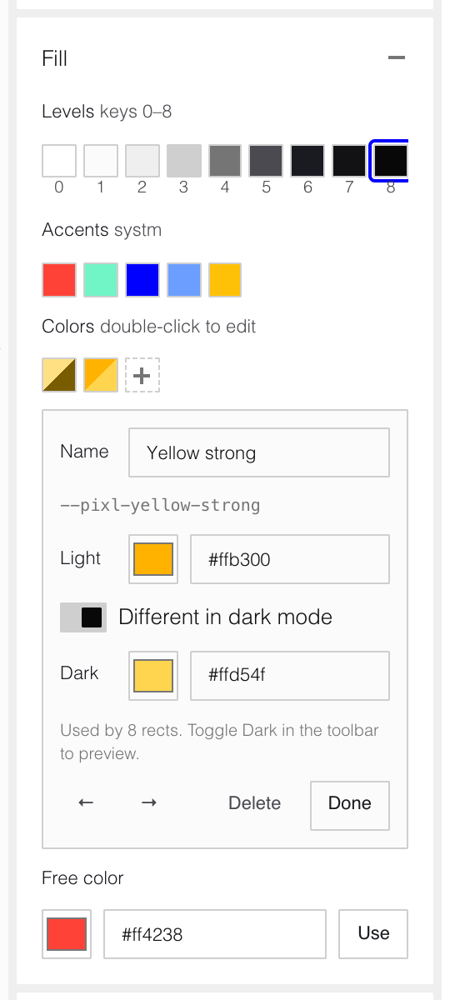

# Pixl Editor

A small, Figma-like editor for the pixl icon set. You draw icons from pixels on an infinite canvas, using the `@indxsearch/systm` levels, accents and pixl's own colors. The editor exports the SVGs that become the React components in this package.

It runs locally inside this repo and reads and writes the project files directly. It isn't part of the published package.

<picture>
  <source media="(prefers-color-scheme: dark)" srcset="../docs/screenshots/overview-dark.png">
  
</picture>

## Getting started

From the repo root:

```bash
npm run editor:install   # first time only
npm run editor           # opens http://localhost:5175
```

The editor opens `pixl.json` from the repo root. This file is the source of truth for every icon, so commit it.

## Concepts

- **Artboards** group icons, for example "Core icons" or "Vehicles". They only organize the canvas and don't affect the exported files.
- **Icons** are components: named 7×5 frames made of pixels. Only icons are exported. Loose pixels drawn directly on an artboard are sketches.
- **Pixels** are rectangles snapped to the grid. Inside an icon you always edit 1×1 pixels: entering an icon splits it, and drawing a rect adds one pixel per cell. When you leave an icon, the editor merges its pixels into as few rectangles per color as possible to keep `pixl.json` small. This is the "Auto merge" toggle. Exported SVGs are the same either way.
- **Icons are drafts by default** and are skipped by Export all. Turn on "Include in export" for each icon that is ready. Turning off "Include in Export all" on an artboard skips every icon on it.

## Drawing

<picture>
  <source media="(prefers-color-scheme: dark)" srcset="../docs/screenshots/edit-icon-dark.png">
  
</picture>

- Press **A** and drag to create an artboard.
- Press **I** and click an artboard to place an empty icon.
- Press **R** and drag to draw pixels. Inside an icon they belong to that icon. The tool switches back to Select when you let go, like in Figma.
- Or draw loose pixels, select them and press **⌘⌥K** to make them into an icon.
- Double-click an icon, or select it and press **Enter**, to edit its pixels. **⌘-click** jumps straight to a pixel. **Esc** leaves the icon.
- **⌥-drag** duplicates. Arrow keys nudge by one pixel.
- Double-click a name to rename it, either on the canvas or in Layers. Enter saves and Escape cancels.
- Right-click anything for its actions: edit, rename, include in export, merge, copy SVG, export, duplicate, reorder, delete.

<picture>
  <source media="(prefers-color-scheme: dark)" srcset="../docs/screenshots/context-menu-dark.png">
  
</picture>

Select an artboard to set its **icon grid**: columns, gap and padding. **Arrange icons** lays its icons out in reading order and resizes the artboard to fit.

## Colors

<picture>
  <source media="(prefers-color-scheme: dark)" srcset="../docs/screenshots/colors-dark.png">
  
</picture>

The Fill panel offers four kinds of fill:

| Kind | Exported as | Dark mode |
|---|---|---|
| **Levels** `0`–`8` | `var(--lv0)`…`var(--lv8)` | Switches with systm |
| **Accents** from systm | `var(--CSignal)`, `var(--CTeal)`, `var(--CPureBlue)`, `var(--CLightBlue)`, `var(--CWarning)` | Same in both modes |
| **Colors**, pixl's own library | `var(--pixl-name, #light)` | Optional dark value |
| **Free colors** | Plain hex | Same in both modes |

- Keys **0**–**8** set the level of the selection.
- Click **+** in the Colors row to add a color. Double-click a swatch to edit its name, light value and dark value. Changing a color updates every pixel that uses it.
- Deleting a color that's in use asks what to replace it with.
- Double-click a recent free color to turn it into a library color.
- The **Dark** toggle in the toolbar previews the canvas in dark mode.

## Saving and exporting

- **Saving is automatic.** Edits are written to `pixl.json` about a second after you stop. **⌘S** saves right away.
- **If `pixl.json` changes on disk**, from another tab, `git pull` or a checkout, an idle editor reloads it. If you have unsaved edits, a banner lets you reload from disk or keep your version. The editor never silently overwrites the file.
- **Export all** writes one SVG per icon to `raw-icons/` and writes `colors.css`. It can also run `convert-icons.js` to regenerate the React components. Icons not included in export are skipped and listed in the dialog.
- **Copy SVG** and **Export** in the icon inspector handle a single icon.

## Bringing icons in

- **Paste from Figma:** select a frame in Figma and choose *Copy/Paste as › Copy as SVG*, then press **⌘V** in the editor.
  - Each 7×5 child frame becomes an icon, and colors close to a level, accent or library color snap to it.
  - Layer names come through if Figma writes ids into the SVG. Turn on "Include id attribute" in Figma's export settings.
- **Import** reads every SVG in `raw-icons/` into a new artboard.

## Shortcuts

| Keys | Action |
|---|---|
| **V** / **A** / **I** / **R** | Select, artboard, icon and rect tools |
| **G** | Toggle the pixel grid |
| **0**–**8** | Set level |
| **Enter** | Edit the selected icon |
| Double-click | Edit an icon |
| **⌘-click** | Select a pixel inside an icon |
| **Esc** | Clear the selection, then leave the icon |
| **⌘A** | Select all at the current level |
| **⌥-drag** / **⌘D** | Duplicate |
| Arrow keys | Nudge by one pixel |
| **⌘[** / **⌘]** | Send to back / bring to front |
| **⌫** | Delete |
| **⌘⌥K** | Make component |
| **⌥⌘U** | Merge an icon's pixels |
| **⌘E** | Copy the icon as SVG |
| **⌘V** | Paste SVG |
| **⌘Z** / **⇧⌘Z** | Undo / redo |
| **⌘S** | Save now |
| **⇧2** / **⌘0** | Zoom to selection / zoom to fit |
| **⌘+** / **⌘−** | Zoom in / out |
| Scroll / **Space**-drag | Pan |
| **⌘**-scroll | Zoom |

## How it works

- **Stack:** Vite, React and TypeScript, with the UI built from `@indxsearch/systm` components and `@indxsearch/pixl` icons.
- **File access:** a Vite dev-server plugin in `server/fileApi.ts` serves the file API. It reads and writes `pixl.json`, writes `raw-icons/` and `colors.css`, runs the converter, and tells open tabs when `pixl.json` changes on disk. Saves only go through when the file is still the version the tab loaded.
- **Document model:** `src/model/` holds the pure document operations, SVG import and export, the pixel union (one outline path per color), color handling and Figma paste parsing.
- **Canvas:** `src/canvas/` is a single SVG with pan and zoom. Selection, handles, drawing and hit testing live here.

### pixl.json

```jsonc
{
  "version": 1,
  "colors": [
    { "id": "…", "name": "Yellow strong", "light": "#ffb300", "dark": "#ffd54f" }
  ],
  "artboards": [
    {
      "id": "…", "name": "Core icons", "x": 0, "y": 0, "w": 247, "h": 147,
      "grid": { "cols": 20, "gap": 5, "pad": 6 },
      "export": true,
      "rects": [],                       // loose pixels, not exported
      "icons": [
        {
          "id": "…", "name": "search", "x": 6, "y": 6, "w": 7, "h": 5, "export": true,   // drafts omit this
          "rects": [{ "id": "…", "x": 2, "y": 0, "w": 2, "h": 1, "fill": "lv8" }]
        }
      ]
    }
  ]
}
```

Positions are in icon pixels. A `fill` is a level (`lv0`–`lv8`), an accent (`CSignal`), a library color (`c:<id>`) or a hex value.
